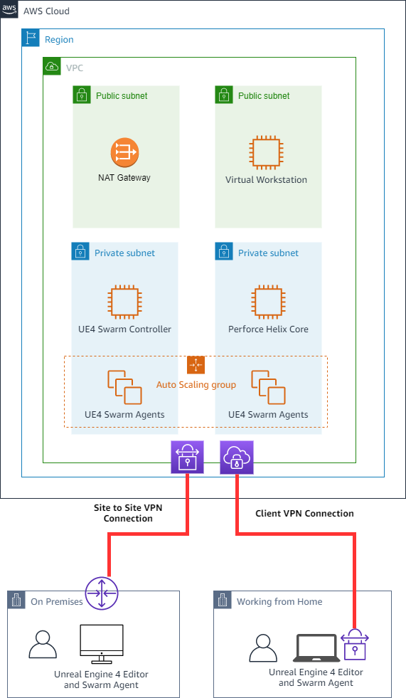

# Guidance for a Game Production Environment on AWS

- [Overview](#overview)
  - [Contents](#contents)
  - [Architecture Diagram](#architecture-diagram)
  - [Cost](#cost)
- [Prerequisites](#prerequisites)
  - [Operating System](#operating-system)
- [Deployment steps](#deployment-steps)
  - [Initiate CDK (Optional)](#initiate-cdk-optional)
  - [Deployment of the Foundations Stack](#deployment-of-the-foundations-stack)
  - [Deployment of the Perforce Helix Core Stack](#deployment-of-the-perforce-helix-core-stack)
  - [Deployment and Setup of the Virtual Workstation Stack](#deployment-and-setup-of-the-virtual-workstation-stack)
    - [Deployment of the Virtual Workstation](#deployment-of-the-virtual-workstation)
    - [Setup of the Virtual Workstation](#setup-of-the-virtual-workstation)
    - [Deployment of the Unreal Engine 5 Swarm Cluster](#deployment-of-the-unreal-engine-5-swarm-cluster)
      - [Collecting dependencies](#collecting-dependencies)
      - [Deployment](#deployment)
      - [A look behind the curtain](#a-look-behind-the-curtain)
        - [Baking custom Windows AMI for UE5 Swarm](#baking-custom-windows-ami-for-ue5-swarm)
        - [Deploying UE5 Swarm Coordinator](#deploying-ue5-swarm-coordinator)
        - [Deploying UE5 Swarm Agent Auto Scaling Group](#deploying-ue5-swarm-agent-auto-scaling-group)
- [Deployment Validation and Running the Guidance](#deployment-validation)
- [Cleanup](#cleanup)
- [Extra Tips](#extra-tips)
  - [How to access the EC2 instances in the private subnets](#how-to-access-the-ec2-instances-in-the-private-subnets)
  - [How to access the Unreal Engine 5 Swarm Agent logs?](#how-to-acess-the-unreal-engine-5-swarm-agent-logs)
  - [Updating CloudFormation templates after code changes](#updating-cloudformation-templates-after-code-changes)
- [Security](#security)
- [License](#license)

# Overview

Quickly deploy a Cloud Game Development environment for you and your team, with this AWS Sample. Once deployed, you will have high performance virtual workstation, central version control system, and acceleration of compute heavy tasks by distributing the work to other machines on demand.

The AWS Cloud Development Kit(CDK), or optionally AWS CloudFormation templates, creates a new AWS Virtual Private Cloud (VPC), a customizable virtual workstation, a [Perforce Helix Core](https://www.perforce.com/solutions/game-development) server, and an [Unreal Swarm](https://docs.unrealengine.com/5.3/en-US/unreal-swarm-in-unreal-engine/) cluster. The latter can be used to accelerate Unreal Engine 5 lighting builds using the vast compute resources available in AWS.

Please note that this guidance was written using CDK v1 and the customer is responsible for updating to CDK v2 if they wish.

Optionally you can add on other solutions from partners such as [Epic Games](https://partners.amazonaws.com/partners/0010h00001ffwqNAAQ/), [HP Anyware](https://www.teradici.com/partners/cloud-partners/aws), [Parsec](https://aws.amazon.com/marketplace/seller-profile?id=2da5e545-e16e-4240-895a-4bbc4a056fbf), and [Incredibuild](https://www.incredibuild.com/partners/aws). These partner solutions further accelerate your development with:

- [HP Anyware and Unreal Engine integrated virtual workstation on AWS Marketplace](https://aws.amazon.com/marketplace/pp/prodview-fryvjy6m3qn2q)
- [Parsec for Teams virtual workstation on AWS Marketplace](https://aws.amazon.com/marketplace/seller-profile?id=2da5e545-e16e-4240-895a-4bbc4a056fbf)
- [Incredibuild Cloud managed build acceleration solution](https://aws.amazon.com/marketplace/pp/prodview-gaxjwt6msh55q)

## Contents

This project repository contains:

- **Infrastructure deployment automation** that deploys required infrastructure resources using AWS CDK or AWS CloudFormation.
- **PowerShell Scripts** that are used to:
- - Collect dependencies from your Unreal Engine 5 installation
- - Setup the Unreal Engine 5 Swarm coordinator and agents.
- - Setup the Virtual Workstation
- **Bash Scripts** to setup a secure Perforce Helix Core Server

You can deploy this multiple ways, with the easiest being the [AWS CloudFormation](https://aws.amazon.com/cloudformation/) web interface to deploy the following CloudFormation stacks from the `cloudformation` folder in this repository:

- `cloudformation/gpic-pipeline-foundation.yaml`
- `cloudformation/gpic-pipeline-perforce-helix-core.yaml`
- `cloudformation/gpic-pipeline-virtual-workstation.yaml`
- `cloudformation/gpic-pipeline-swarm-cluster.yaml`

Download these four files locally and follow the instructions below, only using the AWS CDK or AWS CLI as described below if you are familiar with that process.

## Architecture Diagram



## Cost

You are responsible for the cost of the AWS services used while running this Guidance. As of 7-November-2023, the cost for running this Guidance with the default settings in the US East (N. Virginia) region is approximately $544 per month for 40 hours per week of use (instances stopped when not in use).

Note that this estimate does not include costs of third party software installed with this guidance, including Unreal Engine and associated tools, Perforce Helix Core, Incredibuild, Parsec, HP Anyware, and any others.

# Prerequisites

## Operating System

This guidance can be deployed from any Windows, macOS, or Linux environment with an internet connection and the ability to run Python 3 and the AWS Cloud Development Kit (AWS CDK).

# Deployment steps

On a high level the deployment is split into four (4) parts.

The first step is to deploy the _gpic-pipeline-foundation_ stack. This will setup a VPC, private- and public -subnets, the network routing and a S3 bucket which is needed in subsequent steps.

The second step is to deploy the _gpic-pipeline-perforce-helix-core_ stack. This will deploy a secure Perforce Helix Core Server into one of the private subnets and configure it according to best-practices. Once this machine is up and running you can connect to it as user `perforce` using P4V/P4/P4Admin. The password for the user `perforce` can be retrieved via [AWS Secrets Manager](https://aws.amazon.com/secrets-manager/).

The third step is to deploy the _gpic-pipeline-virtual-workstation_ stack. Once this machine is up and running you can connect to it as user `Administrator` via RDP using the public IP address (or the public DNS name). The password for the user `Administrator` can be retrieved via the [AWS Secrets Manager](https://aws.amazon.com/secrets-manager/).

The last step is the deployment of the _gpic-pipeline-swarm-cluster_ stack, which will deploy a Unreal Engine 5 Swarm Coordinator into one of the private subnets as well as an Amazon EC2 AutoScaling consisting of Unreal Engine 5 Swarm agents.

For the best possible experience, we recommend to deploy this example in the AWS region closest to you.

## Initiate CDK (Optional)

> This step is optional if you decide to use the CloudFormation templates in the `cloudformation` directory, which is recommended for most users.

This project uses a standard Python CDK project to deploy this example. If you don't have CDK installed, please follow the instructions at [AWS Cloud Development Kit](https://docs.aws.amazon.com/cdk/latest/guide/getting_started.html#getting_started_install) documentation.

When you have CDK and Python installed you can use following steps to initiate this project:

Create a python virtualenv

MacOS and Linux:

```
 python3 -m venv .venv
```

Windows

```
python -m venv .venv
```

After the virtualenv is created, you can use the following step to activate your virtualenv.

MacOS and Linux:

```
source .venv/bin/activate
```

Windows:

```
source.bat
```

Once the virtualenv is activated, you can install the required dependencies.

```
pip install -r requirements.txt
```

> If you run on a MacOS or Linux, you potentialy need to modify the file `cdk.json` to use the correct python version. This CDK application expects that `python` is a symlink to python3 or the binary for python verions 3.

## Deployment of the Foundations Stack

The Foundation stacks deploys an AWS Virtual Private Cloud (VPC) with two public subnets, two private subnets and a NAT Gateway. It also deploys a S3 bucket, which is utilized by the other stacks of this example.

You can use the `cloudformation/gpic-pipeline-foundation.yaml` template to create a CloudFormation stack called `gpic-pipeline-foundation` using the AWS Console and AWS CLI. If you want to customize the VPC CIDR you will need to edit the CloudFormation template or use the CDK to synthesize new one with the CDK context variable (see the [Tips](#extra-tips) section).

Alternatively can deploy this stack with CDK or by AWS CLI. By default we will create a VPC with a CIDR prefix of `10.0.0.0/16` and allow traffic to the Virtual Workstation, the Perforce Helix Core Server and the Unreal Engine 5 Swarm coordinator and agents from CIDR Prefix `10.0.0.0/8`. In addition we will allow traffic from the CIDR prefix `0.0.0.0/0.` to the Virtual Workstation for ease of use. These values can be changed by editing the `cdk.json`-file and giving new values for `foundation_vpc_cidr`, `virtual_workstation_trusted_internal_cidr`, `virtual_workstation_trusted_remote_cidr`, `unreal_engine_swarm_cluster_trusted_internal_cidr` and `perforce_trusted_internal_cidr`.

To deploy the foundation stack please run the following command:

```
cdk deploy gpic-pipeline-foundation
```

CLI deployment command:

```
aws cloudformation create-stack --stack-name gpic-pipeline-foundation --template-body file://cloudformation/gpic-pipeline-foundation.yaml
```

Once the creation of resources is ready you can move to [next step](#deployment-of-the-perforce-helix-core-stack).

## Deployment of the Perforce Helix Core Stack

The Perforce Helix Core stack deploys an EC2 instance based on the latest Amazon Linux 2 AMI into one of the private subnets and setup the Perforce Helix Core daemon using [Perforce Helix Server Deployment Package (SDP)](https://swarm.workshop.perforce.com/projects/perforce-software-sdp/view/main/doc/SDP_Guide.Unix.pdf). In the default configuration access to this machine is only allowed by the CIDR prefix `10.0.0.0/8` on port 1666. These CIDR prefix can be changed by editing the `cdk.json` and modifying the value of `perforce_trusted_internal_cidr`.

To deploy the Perforce Helix Core stack you can use the `cloudformation/gpic-pipeline-perforce-helix-core.yaml` template to create a CloudFormation stack called `gpic-pipeline-perforce-helix-core` using the AWS Console.

Alternatively you can deploy the Perforce Helix Core stack using AWS CDK with the following command:

```
cdk deploy gpic-pipeline-perforce-helix-core
```

You can also use the AWS CLI. If you want to customize the VPC CIDR you will need to edit the CloudFormation template or use the CDK to synthesize new one with the CDK context variable (see the [Tips](#extra-tips) section).

AWS CLI command:

```
aws cloudformation create-stack --stack-name gpic-pipeline-perforce-helix-core --template-body file://cloudformation/gpic-pipeline-perforce-helix-core.yaml --capabilities CAPABILITY_NAMED_IAM
```

To access the Perforce Helix Core server with the P4/P4V/P4Admin please use the user `perforce`. The password for this user can be obtained via the AWS Secrets Manager. To access the server via Secure Shell (SSH), please use the AWS Systems Manager Session Manager.

Once the creation of resources is ready you can move to [next step](#deployment--setup-of-the-virtual-workstation-stack).

## Deployment and Setup of the Virtual Workstation Stack

This deployment will not only launch a virtual workstation, it will also deploy the necessary security groups and additional AWS infrastructure to use when deploying other workstations from the AWS Marketplace as in the [Description](#description).

### Deployment of the Virtual Workstation

The Virtual Workstation stack deploys an EC2 Instance based on the latest Microsoft Windows Server 2019 Base AMI in one of the public subnets. In this process we also:

- Set the password for the user "Administrator"
- Install the latest [NVIDIA Grid driver](https://docs.aws.amazon.com/AWSEC2/latest/WindowsGuide/install-nvidia-driver.html#nvidia-GRID-driver)
- Setup Windows 2019 Server firewall and allow ingress traffic for the following applications/protocols:
  - ICMP
  - PCoIP
  - Parsec
  - NICE-DCV
  - HP Anyware
  - Unreal Engine 5 Swarm

You can use the `cloudformation/gpic-pipeline-virtual-workstation.yaml` template to create a CloudFormation stack called `gpic-pipeline-virtual-workstation` using the AWS Console. To customize this workstation further, you will need to use the AWS CDK or AWS CLI. It is recommended to launch this stack with defaults then deploy Marketplace AMIs into the same VPC created in the first stack.

Access to this virtual workstation is controlled by the variables `virtual_workstation_trusted_internal_cidr` and
`virtual_workstation_trusted_remote_cidr` in `cdk.json`.

To deploy the Virtual Workstation stack please via AWS CDK, run the following command:

```
cdk deploy gpic-pipeline-virtual-workstation
```

If you want to customize the trusted CIDR's you will need to edit the CloudFormation template or use the CDK to synthesize new one with the CDK context variable (see the [Tips](#extra-tips) section).

AWS CLI command:

```
aws cloudformation create-stack --stack-name gpic-pipeline-virtual-workstation --template-body file://cloudformation/gpic-pipeline-virtual-workstation.yaml --capabilities CAPABILITY_IAM
```

Once the creation of resources is finished you can move to [next step](#connecting-to-initial-virtual-workstation).

### Connecting to initial Virtual Workstation

If you are using this initial virtual workstation, you can configure the instance by first connecting via Remote Desktop Protocol (RDP) by doing the following:

Open a client capable of connection to a Windows computer using RDP.

- Windows has the Remote Desktop Connection software built in. Search for Remote Desktop Connection in the Windows taskbar
- For macOS, you'll need to download the [Remote Desktop client](https://learn.microsoft.com/en-us/windows-server/remote/remote-desktop-services/clients/remote-desktop-mac)
- For Linux, you'll need to obtain an RDP capable like Remmina or TeamViewer

To access the Virtual Workstation use the public IP/DNS, which can be obtained via the Output values from CDK/CloudFormation stack or alternatively via the AWS Management Console.

Once you're connected, you'll need to log in with credentials that you retrieve from
AWS Secrets Manager. To find the credentials:

- Open the AWS console and navigate to the AWS CloudFormation console
- In the CloudFormation console, select the **gpic-pipeline-virtual-workstation** stack and expand the **Virtual Workstation Password**
- Select the **Physical ID** and you will be navigated to the AWS Secrets Manager console with the correct secret open
- Select **Retrieve secret value** to see the password
- Copy the password, use **administrator** for the user name and paste the password

Once you are logged in, you have several options for installing high performance connection protocols:

- [NICE DCV](https://aws.amazon.com/hpc/dcv/)  
  Follow the [installation steps in the NICE DCV Administrator Guide](https://docs.aws.amazon.com/dcv/latest/adminguide/setting-up-installing-wininstall.html).

- [Parsec](https://parsec.app/)
  - Open a PowerShell and run the [script](https://github.com/parsec-cloud/Parsec-Cloud-Preparation-Tool#copy-this-code-into-powershell-you-may-need-to-press-enter-at-the-end), which is provided by Parsec in their GitHub repository
  - Question: Do you want this computer to log on to Windows automatically? Yes
  - Once the installation is finished, the script will open up an additional Powershell session to update the GPU driver. Please close this Powershell session and don't provide a ACCESS_KEY & SECRET_ACCESS_KEY. We have already-installed the latest NVIDIA Grid driver on the virtual workstation.
  - Close all remaining Powershell sessions
  - Sign-Up for a Parsec account or use an existing Parsec account to login
- HP Anyware  
  Visit the [HP Anyware free trial page](https://connect.teradici.com/hp-anyware-30-day-trial) for more information on installation.

### Setup of the Virtual Workstation

There are some Windows Firewall rules that need to be added when using some software on an AWS virtual workstation. You can run the below PowerShell commands to add these rules:

Parsec

`New-NetFirewallRule -DisplayName 'Allow Parsec' -Direction Inbound -Action Allow -Protocol TCP -LocalPort 1666`

HP Anyware

`New-NetFirewallRule -DisplayName 'Allow PCoIP' -Direction Inbound -Action Allow -Protocol TCP -LocalPort 4172`

`New-NetFirewallRule -DisplayName 'Allow PCoIP' -Direction Inbound -Action Allow -Protocol UDP -LocalPort 4172`

`New-NetFirewallRule -DisplayName 'Allow PCoIP' -Direction Inbound -Action Allow -Protocol TCP -LocalPort 443`

NICE DCV

`New-NetFirewallRule -DisplayName 'Allow PCoIP' -Direction Inbound -Action Allow -Protocol TCP -LocalPort 8443`

Unreal Engine Swarm Communication

`New-NetFirewallRule -DisplayName 'Allow UE5 Swarm TCP' -Direction Inbound -Action Allow -Protocol TCP -LocalPort 8008-8009`

`New-NetFirewallRule -DisplayName 'Allow UE5 Swarm UDP' -Direction Inbound -Action Allow -Protocol UDP -LocalPort 8008-8009`

`New-NetFirewallRule -DisplayName 'Allow ICMP' -Direction Inbound -Action Allow -Protocol ICMPv4`

Below you will find instructions on adding additional software to your virtual workstation:

- [Perforce Helix](https://www.perforce.com/)
  - Steps:
    - Download and Install the Helix Visual Client (P4V) from [here](https://www.perforce.com/downloads/helix-visual-client-p4v)
    - Steps in the Installation Wizard:
      - Keep all application selected and hit _Next_
      - For the Server please enter the private IP/DNS name of the Perforce Helix Core server we deployed earlier. You can find the private IP/DNS name in the CDK/CloudFormation Outputs or via the AWS Management Console. Example: `ip-10-0-XXX-XXX.eu-central-1.compute.internal:1666`
      - The User Name is `perforce`
      - Hit _Next_
      - Hit _Next_
      - Hit _Install_
      - Uncheck "Start P4V" and hit _Exit_
- [Unreal Engine 5](https://www.unrealengine.com/en-US/download)
  You need to Sign-Up for an EPIC account or use your existing one. Alternatively you can clone the Unreal Engine 5 source from Github if you have connected your EPIC Account with your Github account.
- [Incredibuild Cloud (optional)](https://www.incredibuild.com/partners/aws)  
  To install Incredibuild Cloud, you can either install from the [AWS Marketplace](https://aws.amazon.com/marketplace/pp/prodview-gaxjwt6msh55q) or follow the [Incredibuild installation instructions](https://docs.incredibuild.com/cloud/cloud_initiating.html).

Now, start the PV4 application and connect to the Peforce Helix Core server. The password of the user `perforce` can be found in the AWS Secrets Manager.

Once you are done please continue to the [next step](#deployment-of-the-unreal-engine-5-swarm-cluster)

### Deployment of the Unreal Engine 5 Swarm Cluster

#### Collecting dependencies

Each Windows instance that will act as a Swarm Coordinator or as a Swarm Agent will need a set of prerequisites installed.
We can collect these prerequisites from the Unreal Engine 5 version you installed on the Virtual Workstation with the provided `assets/unreal-engine-swarm-create-dependencies-archive.ps1` script in this repository.

- If you are no longer logged into the Virtual Workstation, please login again.
- Please download the script `unreal-engine-swarm-create-dependencies-archive.ps1` from the `assets` folder to the virtual workstation
- This PowerShell script will copy all the components that are needed to customize a fresh Window installation
- The script assumes that your Unreal Engine is installed to `C:\Program Files\Epic Games\UE_5.2` directory but you can customize the script to match your location
- Script will create a compressed archive called `ue5-swarm-archive.zip` under your `My Documents` directory
- You can find more details about these prerequisites at:
  - [Unreal Engines 5's Hardware and Software requirements](https://docs.unrealengine.com/en-US/GettingStarted/RecommendedSpecifications/index.html) -page
  - [Setting up Swarm Coordinator and Swarm Agents instructions](https://docs.unrealengine.com/en-US/Engine/Rendering/LightingAndShadows/Lightmass/UnrealSwarmOverview/index.html) -page

After you have created the `ue5-swarm-archive.zip` -archive you need to upload it into the root directory of the newly created S3 bucket. It will be downloaded from that location and used during the EC2 Image Builder process. The name of the bucket is available as an output called `BucketName` from the `gpic-pipeline-foundation` stack.

With [AWS Tools for PowerShell](https://docs.aws.amazon.com/powershell/latest/reference/index.html) you can use following command to first list buckets and fetch the name of the bucket created by the foundation stack:

```
Get-S3Bucket
```

Then write the local file to the specified bucket and key:

```
Write-S3Object -BucketName <NAME OF THE S3 BUCKET> -Key ue5-swarm-archive.zip -File ue5-swarm-archive.zip
```

#### Deployment

To deploy the Swarm Cluster you can use the `cloudformation/gpic-pipeline-swarm-cluster.yaml` template to create a CloudFormation stack called `gpic-pipeline-swarm-cluster` using the AWS Web Console.

You can deploy with AWS CDK using the following command:

```
cdk deploy gpic-pipeline-swarm-cluster
```

Alternatively you can use the AWS CLI with this command:

CLI example:

```
aws cloudformation create-stack --stack-name gpic-pipeline-swarm-cluster --template-body file://cloudformation/gpic-pipeline-swarm-cluster.yaml --capabilities CAPABILITY_NAMED_IAM
```

This step will take **30 minutes** on average as it's baking the Window AMI for Swarm. The steps to install all dependencies does take some time to complete. While the deployment is running you can read [below](#a-look-behind-the-curtains) for details on what's happening during stack creation.

Once this stack is deployed, please proceed to the [final step](#finish)

#### A look behind the curtain

##### Baking custom Windows AMI for UE5 Swarm

The `gpic-pipeline-swarm-cluster` -stack will first configure EC2 Image Builder to use latest "Microsoft Windows Server 2019 Base" image as the base image. It also creates a EC2 Image Builder component defining the build steps. These steps will download the Zip archive from S3, install .Net runtime, run the `UEPrereqSetup_x64.exe` installer and then open Windows Firewall for the Swarm ports. You can view the `assets/unreal-engine-swarm-cluster-component.yaml` file for details.

Once the EC2 Image Builder completes it will create a private AMI under your account. This AMI contains all the required Unreal Engine 5 Swarm build dependencies and can be used to quickly launch the Swarm Coordinator and Swarm Agents.

##### Deploying UE5 Swarm Coordinator

The Swarm Coordinator will be launched as a single EC2 Instance. The launch will use `User Data` to configure the Windows to start `SwarmCoordinator.exe` on boot. You can view the contents of the `User Data` in `assets/setup-unreal-engine-swarm-coordinator.ps1` - Powershell script.

##### Deploying UE5 Swarm Agent Auto Scaling Group

The Swarm Agents are going to be launched as Auto Scaling Group. Enabling us to quickly scale the number of nodes up and down. As the Swarm Agents need to be already online and registered when you submit a UE5 build, we can't use any metrics to scale the cluster on demand.
Instead you can use for example Schedule or some script to scale the cluster before submit a job. With a schedule you could for example configure the cluster to scale up to certain number of nodes in the morning and then after office hours scale the cluster back to zero.

The Swarm Agent will also use `User Data` to configure the Windows to start `SwarmAgent.exe` on boot and injects a Swarm configuration file into the Instance. This configuration file will set number of threads to equal amount of CPU Core and also will set the Coordinator IP address. You can view the contents of the `User Data` in `assets/setup-unreal-engine-swarm-agent.ps1` - Powershell script.

# Deployment Validation

Now that the `gpic-pipeline-swarm-cluster.yaml` stack has completed deployment you should see two additional EC2 Instances running in your new VPC. Also the CDK/CloudFormation stack should have output the private IP address of the Unreal Engine 5 Swarm Coordinator.

On your Virtual Workstation you have to configure the local Swarm Agent. You can launch it from `C:\Program Files\Epic Games\UE_5.27\Engine\Binaries\DotNET` directory. The application can be accessed by double clicking the Swarm Agent icon in the Taskbar (System Tray). After this you will need to configure the following values accessible in the **Settings** tab:

- `AgentGroupName`: `ue5-swarm-aws`
- `AllowedRemoteAgentGroup`: `ue5-swarm-aws`
- `AllowedRemoteAgentNames`: `*`
- `CoordinatorRemotingHost`: `<Add coordinator private IP from the Stack output>`

Once this is done start experimenting with your environment. Here are some example tasks that you might want to test:

- Create a streaming depot
- Create a mainline stream
- Create additional Perforce user and grant them access to the newly created streaming depot
- Create a new workspace
- Create a `.p4ignore` file for your Unreal project, mark it for add and submit it to the mainline stream
- Set the correct typemap for an Unreal project
- Start Unreal Engine 5
- Create a new Unreal project
- Close Unreal Engine 5
- Move your Unreal project into your Perforce Workspace
- Mark your Unreal project folder for add and submit it to the mainline stream
- Open the Unreal project and setup Perforce integration
- Reconfigure the EC2 Autoscaling Group to use more instances
- Submit a lightning build and see your Unreal Engine 5 Swarm agents in action

If you have any questions regarding the steps outlined above feel free to reach out to us.

_Please, don't forget stop the resources if you are not working with them, otherwise you will incur unnecessary cost. You can simply stop the Virtual Workstation, the Perforce Helix Core server and the Unreal Engine 5 Swarm Coordinator if you are taking a break and restart these instances when you want to continue to work with them. The same applies to the Unreal Engine 5 Swarm agents, with the only caveat that the start and termination of these instances is managed by an EC2 Auto Scaling group. To change the amount of running EC2 instances you need to modify the EC2 Auto Scaling group, see [here](https://docs.aws.amazon.com/autoscaling/ec2/userguide/asg-capacity-limits.html)._

# Cleanup

To clean up this example you need to delete the CloudFormation stacks. Start by deleting the `gpic-pipeline-virtual-workstation`, followed by the `gpic-pipeline-perforce-helix-core` and `gpic-pipeline-swarm-cluster` stacks. Once all of these stacks are completely removed you can delete the `gpic-pipeline-foundation` stack. Additionally terminate any additional workstations launched from the AWS Marketplace.

With CDK you can delete the stacks with:
Example commands:

```
 $  cdk destroy gpic-pipeline-virtual-workstation
```

After you have removed all stacks, two resources need to be deleted manually. First the S3 bucket will need to be deleted manually and second the AMI that was created in context of the Unreal Engine 5 Swarm stack needs to be deleted.

Example commands:

```
 $  aws s3 rb s3://<bucket-name> --force
 $
 $  aws ec2 deregister-image --image-id <AMI ID>
```

# Extra Tips

## How to access the EC2 instances in the private subnets

The Perforce Helix Core Server can be accessed via the AWS Systems Manager - Session Manager.

The Unreal Engine 5 Coordinator and agents can be accessed via RDP utilizing the Virtual Workstation. Alternatively you can use the AWS Systems Manager - Session Manager to open a Powershell session to these instances.

## How to acess the Unreal Engine 5 Swarm Agent logs?

The Swarm Agent writes logs to: `C:\ue5-swarm\SwarmCache\Logs`. See the section [above](#how-to-access-the-ec2-instances-in-the-private-subnets) on how to connect to these EC2 instances.

## Updating CloudFormation templates after code changes

If you do changes to the CDK code and want to generate new CloudFormation templates you will need to use following commands to keep the stack references in sync:

```
cdk synth gpic-pipeline-foundation -e > cloudformation/gpic-pipeline-foundation.yaml
cdk synth gpic-pipeline-perforce-helix-core -e > cloudformation/gpic-pipeline-perforce-helix-core.yaml
cdk synth gpic-pipeline-swarm-cluster -e > cloudformation/gpic-pipeline-swarm-cluster.yaml
cdk synth gpic-pipeline-virtual-workstation -e > cloudformation/gpic-pipeline-virtual-workstation.yaml
```

# Security

See [CONTRIBUTING](CONTRIBUTING.md) for more information.

# License

This library is licensed under the MIT-0 License. See the [LICENSE](LICENSE) file.

The AWS CloudFormation template downloads and installs Perforce Helix Core on EC2 instances during the process. Helix Core is a proprietary software and is subject to the terms and conditions of Perforce. Please refer to EULA in the following page for details. Perforce Terms of Use : https://www.perforce.com/terms-use
